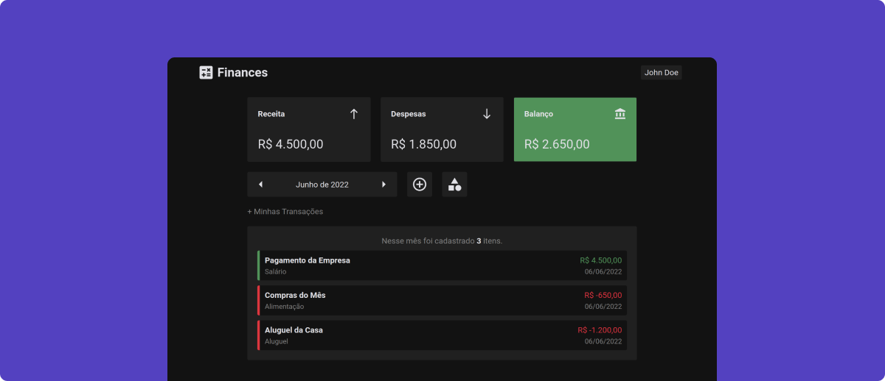

# :zap: Website | Finances App

Esse é o repositório que armazena todo o código que é usado para gerar a plataforma do Finances App.

Esse projeto foi desenvolvido usando [ReactJS](https://pt-br.reactjs.org/) para desenvolvimento da interface, [ViteJS](https://vitejs.dev/) para geração de build do projeto, [TypeScript](https://www.typescriptlang.org/) como linguagem, [Styled Components](https://www.styled-components.com/) para estilização do Layout e [Framer Motion](https://www.framer.com/motion/) para a criação de animações.

## :gear: Como Contribuir

- Faça um fork desse repositório;
- Cria uma branch com a sua feature: `git checkout -b minha-feature`;
- Faça commit das suas alterações: `git commit -m 'feat: Minha nova feature'` seguindo algum dos prefixos de commit abaixo:
    > :warning: Lembrando que será obrigatório a utilização do inglês nas mensagens de commit.
    - `feat:` - Para implementação de uma nova funcionalidade.
    - `fix:` - Para a correção de algum Bug.
    - `chore:` - Para alterações de arquivos sem impacto no projeto.
    - `refactor:` - Para Refatoração de Código.
    - `style:` - Alteração na Formatação do código.
    - `docs:` - Mudanças na Documentação do Projeto.
- Faça push para a sua branch: `git push origin minha-feature`.

## :heart: Contribuidores do Projeto
| [ @TiaGoiNsaNy](https://github.com/TiaGoiNsaNy) |
| :---: | 